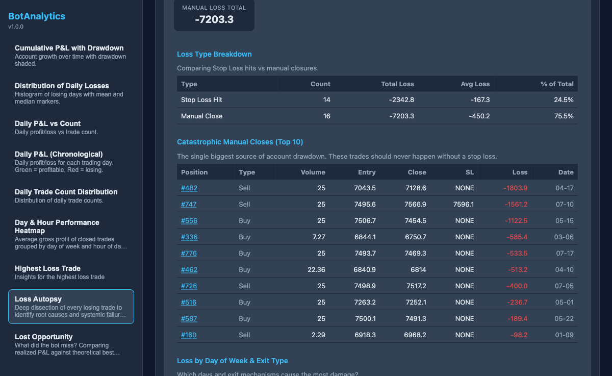
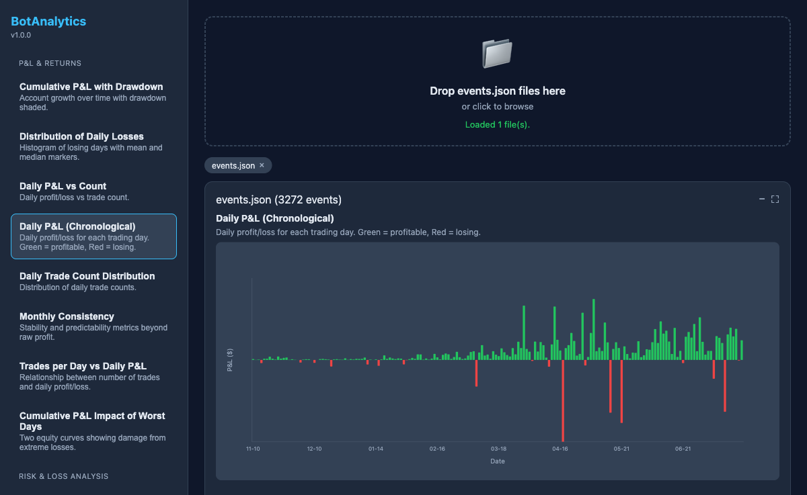
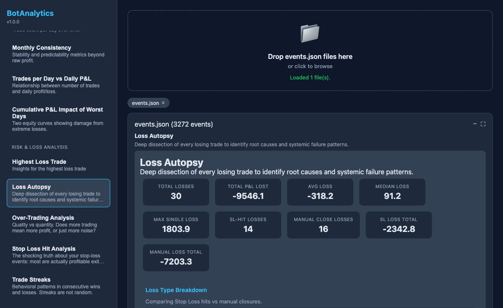
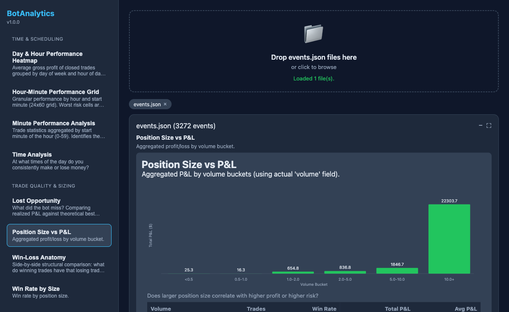
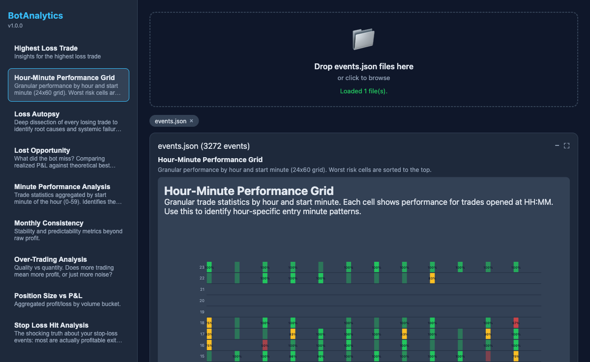
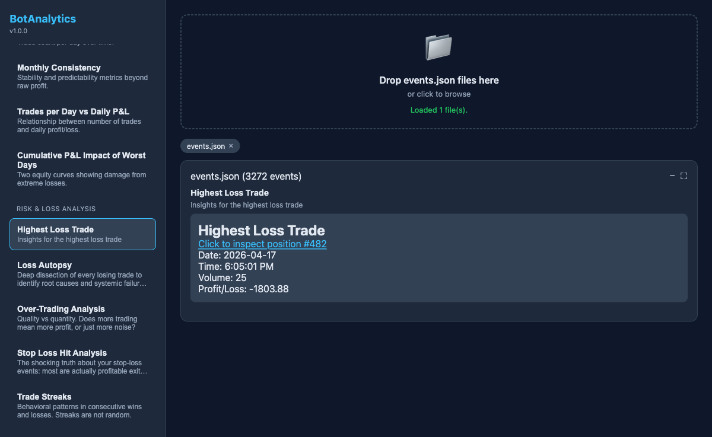

# BotAnalytics

<p align="center">
  
  
  
  
</p>

<p align="center">
  Trade event intelligence. Maximum adverse excursion analysis. Drawdown forensics. Optimal stop-loss recommendations.
</p>

---

## What It Does

BotAnalytics turns raw trade event logs into actionable analytics. Drop in an `events.json` export, and the dashboard renders 38 independent reports covering risk, timing, sizing, strategy forensics, and income planning — no database, no ETL, no config files.

### Key Capabilities

| Capability | Detail |
|---|---|
| **Zero-config ingestion** | Upload `events.json` via drag-and-drop or API |
| **38 built-in reports** | Risk, P&L, time, quality, sizing, strategy, and income planning modules |
| **Optimal SL recommendation** | Statistical MAE analysis with daily/hourly heatmaps and long/short breakdowns |
| **Trade lifecycle inspection** | Click any position ID to view full event timeline with close-event highlighting |
| **Docker-ready** | Single container, bind-mounted dataset, reproducible deploy |
| **Extensible** | Drop a new JS module into `reports/` to add a report |

## Quick Start

### Prerequisites

- Node.js >= 18.x
- npm >= 9.x
- Docker Desktop (optional)

### Local Development

```bash
# Install dependencies
npm install

# Start server
npm start

# Open dashboard
open http://localhost:8054
```

### Docker

```bash
# Build and run
docker compose up --build

# Open dashboard
open http://localhost:8054
```

## Project Structure

```
54-botanalytics/
 ├── server.js                 # Express server, report loader, REST API
 ├── events.json               # Trade event dataset (bind-mounted in Docker)
 ├── reports/                  # Extensible report modules (38 total)
 │   ├── optimal-sl-recommendation.js
 │   ├── drawdown-recovery.js
 │   ├── loss-autopsy.js
 │   ├── win-loss-anatomy.js
 │   ├── passive-income-simulator.js
 │   ├── risk-vs-return-bubble.js
 │   ├── mae-vs-mfe-scatter.js
 │   ├── trade-lifecycle-funnel.js
 │   └── ... (38 total)
 ├── public/
 │   ├── index.html            # Static shell
 │   ├── app.js                # Sidebar, routing, trade detail modal
 │   └── style.css             # Dark theme, responsive layout
 ├── Dockerfile
 ├── compose.yaml
 ├── package.json
 └── README.md
 ```

## Reports at a Glance

| Report | Category | What It Tells You |
|---|---|---|
| **Optimal SL Recommendation** | Risk & Loss Analysis | 95th/90th percentile SL levels from MAE statistics, daily/hourly heatmaps, long/short breakdown |
| **Drawdown Recovery** | P&L & Returns | Drawdown depth, recovery duration, equity curve |
| **Loss Autopsy** | Risk & Loss Analysis | Worst trade spotlight, SL vs manual close breakdown, day/hour heatmaps |
| **Win-Loss Anatomy** | Trade Quality & Sizing | P&L distribution, duration comparison, day expansion, directional win rates |
| **MAE vs MFE Scatter** | Risk & Loss Analysis | Maximum Adverse vs Favorable Excursion scatter to evaluate exit timing |
| **Risk vs Return Bubble** | P&L & Returns | Reward-to-risk bubble visualization with quartile analysis, bubble size = position size |
| **Trade Lifecycle Funnel** | Risk & Loss Analysis | Funnel analysis from entry through breakeven, profit, TP hit, and SL hit |
| **Passive Income Simulator** | Income Planning | Configurable target-income calculator with required volume, margin, and scaled risk |
| **Breakeven-Stop Effectiveness** | Risk & Loss Analysis | How often breakeven protection locks in profit vs gives it back |
| **Trail Efficiency** | Risk & Loss Analysis | Profit give-back between best SL level reached and actual close |
| **SL Hit Analysis** | Risk & Loss Analysis | True SL losses vs profitable trailing stops, SL tightness index |
| **SL Reaction Latency** | Time & Scheduling | Time between entry and first trailing stop vs outcome correlation |
| **Follow Trade After Loss** | Risk & Loss Analysis | Revenge trading probability, consecutive loss streaks |
| **Quick-Scalp Segment** | Trade Quality & Sizing | Sub-5-minute trade metrics vs non-scalp, scalp win rate, hour distribution |
| **Position Size vs P&L** | Trade Quality & Sizing | Volume bucket performance and win-rate correlation |
| **Position Modification Impact** | Risk & Loss Analysis | How SL/TP modifications affect trade outcomes |
| **SL Modification Cadence** | Risk & Loss Analysis | Frequency and timing of stop-loss changes |
| **Time Analysis** | Time & Scheduling | Best/worst trading windows, no-trade zones, start/exit time heatmaps |
| **Strategy Forensics** | Strategy Forensics | Deep strategy breakdown |
| **Trades vs P&L** | P&L & Returns | Trade count distribution vs P&L |
| **Trade Streaks** | Risk & Loss Analysis | Consecutive win/loss patterns, streak impact on equity |
| **Trade Duration Optimality** | Trade Quality & Sizing | Optimal hold time analysis by profit tier |
| **Weekly Consistency** | P&L & Returns | Day-of-week performance consistency |
| **Calendar Day Performance** | Time & Scheduling | Calendar day (1-31) performance to identify no-trade zones |
| **Consecutive Days Impact** | Risk & Loss Analysis | Back-to-back trading day effects on performance |
| **Directional Sizing Bias** | Trade Quality & Sizing | Buy vs Sell position size distribution and outcome correlation |
| **Naked Exposure** | Risk & Loss Analysis | Unprotected position exposure analysis |
| **Risk Consistency Audit** | Risk & Loss Analysis | Risk-taking consistency over time |
| **Overtrading Analysis** | Risk & Loss Analysis | Trade frequency vs diminishing returns, rest-day effect |
| **Monthly Consistency** | P&L & Returns | Month-over-month performance stability, seasonality |
| **Daily Loss Distribution** | P&L & Returns | Daily loss frequency and magnitude distribution |
| **Worst Days Impact** | P&L & Returns | Impact of worst trading days on overall performance |
| **Daily Overview** | P&L & Returns | Executive daily dashboard: KPI cards, P&L timeline, trade count, correlation, calendar heatmap |
| **Hour Minute Performance** | Time & Scheduling | Hour-of-day and minute-of-day performance heatmaps |
| **Minute Performance** | Time & Scheduling | Granular minute-level performance analysis |
| **Market Session Analysis** | Time & Scheduling | Performance across market sessions |
| **Gap Trade Session Edge** | Time & Scheduling | Gap and session transition trade performance |
| **Lost Opportunity** | Trade Quality & Sizing | MFE vs actual capture ratio, "could-have-been" analysis |
| **Concurrent Position Stacked Exposure** | Risk & Loss Analysis | Overlapping position risk and correlated loss detection |

<details>
<summary>View all 38 reports</summary>

| Report ID | Category |
|---|---|
| `breakeven-stop-effectiveness` | Risk & Loss Analysis |
| `calendar-day-performance` | Time & Scheduling |
| `concurrent-position-stacked-exposure` | Risk & Loss Analysis |
| `consecutive-days-impact` | Risk & Loss Analysis |
| `daily-loss-distribution` | P&L & Returns |
| `daily-overview` | P&L & Returns |
| `directional-sizing-bias` | Trade Quality & Sizing |
| `drawdown-recovery` | P&L & Returns |
| `follow-trade-after-loss` | Risk & Loss Analysis |
| `gap-trade-session-edge` | Time & Scheduling |
| `hour-minute-performance` | Time & Scheduling |
| `loss-autopsy` | Risk & Loss Analysis |
| `lost-opportunity` | Trade Quality & Sizing |
| `mae-vs-mfe-scatter` | Risk & Loss Analysis |
| `market-session-analysis` | Time & Scheduling |
| `minute-performance` | Time & Scheduling |
| `monthly-consistency` | P&L & Returns |
| `naked-exposure` | Risk & Loss Analysis |
| `optimal-sl-recommendation` | Risk & Loss Analysis |
| `overtrading-analysis` | Risk & Loss Analysis |
| `passive-income-simulator` | Income Planning |
| `position-modification-impact` | Risk & Loss Analysis |
| `position-size-vs-pnl` | Trade Quality & Sizing |
| `quick-scalp-segment` | Trade Quality & Sizing |
| `risk-consistency-audit` | Risk & Loss Analysis |
| `risk-vs-return-bubble` | P&L & Returns |
| `sl-hit-analysis` | Risk & Loss Analysis |
| `sl-modification-cadence` | Risk & Loss Analysis |
| `sl-reaction-latency` | Time & Scheduling |
| `strategy-forensics` | Strategy Forensics |
| `time-analysis` | Time & Scheduling |
| `trade-duration-optimality` | Trade Quality & Sizing |
| `trade-lifecycle-funnel` | Risk & Loss Analysis |
| `trade-streaks` | Risk & Loss Analysis |
| `trades-vs-pnl` | P&L & Returns |
| `trail-efficiency` | Risk & Loss Analysis |
| `win-loss-anatomy` | Trade Quality & Sizing |
| `worst-days-impact` | P&L & Returns |

</details>

## Screenshots

### Dashboard


### Drawdown Recovery


### Loss Autopsy


### Position Size vs P&L


### Hourly Performance


### Highest Loss Trade


## API Reference

| Method | Path | Description |
|---|---|---|
| `GET` | `/api/reports` | List all available reports |
| `GET` | `/api/reports/:id` | Get rendered report HTML by ID |
| `GET` | `/api/trades/:positionId` | Get full event timeline for a trade |
| `GET` | `/api/version` | App version and deployment metadata |
| `POST` | `/api/upload` | Upload new `events.json` files |

### Example Requests

```bash
# List reports
curl http://localhost:8054/api/reports

# Get a specific report
curl http://localhost:8054/api/reports/optimal-sl-recommendation

# Inspect a trade
curl http://localhost:8054/api/trades/482

# Check version
curl http://localhost:8054/api/version

# Upload new data
curl -F "files=@events.json" http://localhost:8054/api/upload
```

## Data Format

Upload a JSON array of trade events. Each event should follow this schema:

```json
{
  "serial": 0,
  "orderId": null,
  "positionId": 1,
  "event": "Create Position",
  "time": 1762752309164,
  "volume": 1.17,
  "quantity": 1.17,
  "type": "Buy",
  "entryPrice": 6784.4,
  "tp": null,
  "sl": null,
  "closePrice": null,
  "grossProfit": 0,
  "pips": 0,
  "balance": null,
  "equity": 420
}
```

Supported event types: `Create Position`, `Position Modified (S/L)`, `Stop Loss Hit`, `Position closed`.

## Docker

### Build

```bash
docker compose build --no-cache --pull
```

### Run

```bash
docker compose up --force-recreate -d
```

### Environment Variables

| Variable | Default | Description |
|---|---|---|
| `PORT` | `8054` | Server port |
| `APP_VERSION` | `1.4.0` | Version string |

### Volumes

| Mount | Description |
|---|---|
| `./events.json:/app/events.json` | Read-only trade dataset |

## Extending Reports

Each report is a standalone module in `reports/`. The server dynamically imports all `.js` files at startup.

```js
// reports/my-new-report.js
export default async function myNewReport(events) {
  // 1. Filter or aggregate events
  const closed = events.filter(e => e.closePrice != null);

  // 2. Compute metrics
  const total = closed.length;

  // 3. Return HTML
  return {
    title: 'My New Report',
    description: 'What this report shows.',
    html: `<div class="report-body">...</div>`,
    category: 'P&L & Returns',
  };
}
```

No registration required. Restart the server and the report appears in the sidebar.

## Tech Stack

- **Runtime:** Node.js 18+ (ESM)
- **Server:** Express 4.x, Multer 2.x
- **Frontend:** Vanilla JS, CSS Grid/Flexbox
- **Deployment:** Docker Compose
- **Data:** Local JSON, in-memory caching

## Contributing

1. Fork the repo
2. Create a feature branch: `git checkout -b feat/my-report`
3. Add your report under `reports/`
4. Run locally: `npm install && npm start`
5. Commit: `git commit -m "feat(reports): add my-new-report"`
6. Push: `git push origin feat/my-report`
7. Open a Pull Request

## License

MIT

## Author

**Inventions4All** — [github:TWeb79](https://github.com/TWeb79)

Built with systematic debugging discipline, senior-level code standards, and a refusal to leave TODO blocks unresolved.
